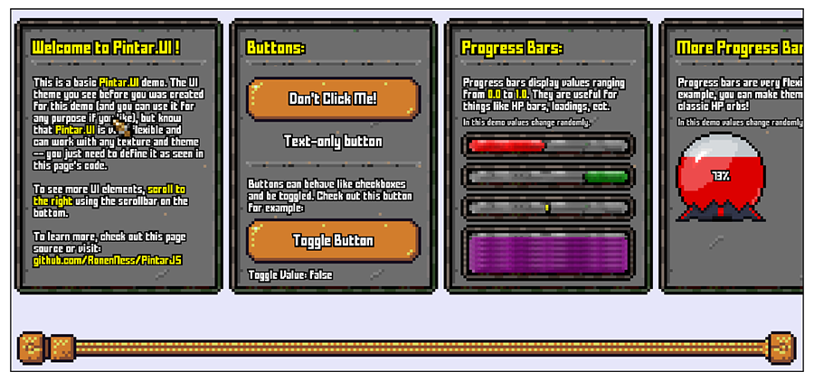
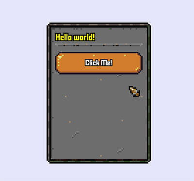
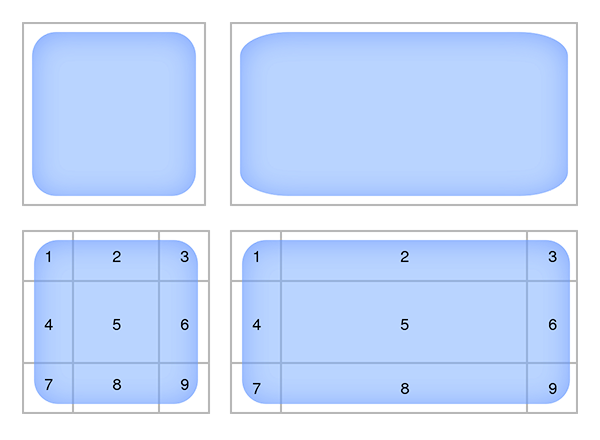
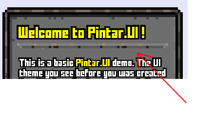
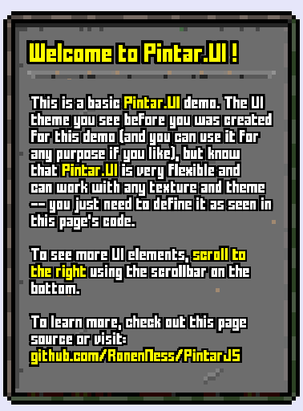
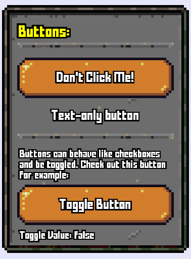

# Pintar.UI

`Pintar.UI` is a built-in UI plugin for `PintarJS`.

A quick example can be seen [here](https://ronenness.github.io/PintarJS/demos/index.html#example9_plugin_ui.html).



## How It Works

`Pintar.UI ` uses `PintarJS` sprites and rendering pipelines to implement basic UI elements, as well as a grid / anchors system, UI theme, sliced sprites, and other UI-related goodies.


## Why Not CSS

You might consider using HTML with CSS for UI instead of `PintarJS`'s native UI. That's a viable option, since ultimately HTML is made for UI and CSS is very powerful these days. However, here are few points to consider:

- Making UI with the same feel as your game using pure CSS would require a lot of work.
- Drawing everything with PintarJS will feel more natural than combining WebGL with HTML. When mixing, there will always be some pixels and movement that won't perfectly align.
- With CSS you need to worry about cross-browser differences that might break your UI. With native UI it will look the same on all browsers.
- With PintarJS UI everything will be part of the canvas you render on, which means you can apply post-effects, take screenshots, set unified resolution, ect.

To summarize, HTML with CSS is great, but mixing it with your WebGL rendering will never feel truly native and will have some caveats that will hinder your UI experience. That's why if you use `PintarJS`, its recommended to also draw and handle UI with it.


## Quick Example

Lets begin with a quick example (note: UI_THEME is defined elsewhere and we'll discuss it later):

```js
// create UI root
var root = new PintarJS.UI.UIRoot(pintar);

// set cursor (your responsibility to hide the real cursor via css)
var cursor = new PintarJS.UI.Cursor(UI_THEME);
root.setCursor(cursor);

// create a panel
var panel = new PintarJS.UI.Panel(UI_THEME);
panel.anchor = PintarJS.UI.Anchors.Center;
panel.size.set(370, 500);
root.addChild(panel);

// add a header (with a horizontal line under it)
var header = new PintarJS.UI.Paragraph(UI_THEME, "header");
header.text = "Hello world!";
panel.addChild(header);
panel.addChild(new PintarJS.UI.HorizontalLine(UI_THEME));

// add a button
var button = new PintarJS.UI.Button(UI_THEME);
button.anchor = PintarJS.UI.Anchors.Auto;
button.text = "Click Me!";
button.onMouseReleased = (btn, input) => { alert("Hi there!"); }
panel.addChild(button);
```

The result of the above would look like this:



# Basic Concepts

Before we dive into using the plugin, lets go over some basic concepts.

## UI Theme

The UI Theme is a dictionary which defines all the UI elements appearance and behavior. This include things likes:

- Texture.
- Scale.
- Source rectangle in texture.
- Margins.
- Default size.
- Is horizontal or vertical, when relevant.
- And much more..

The UI dictionary must have a key for every element type you want to use (key being the element's class name). Every UI element accepts different options.

`Pintar.UI` comes with a demo theme you can use (for any purpose even commercual), which is used by the demo pages. This theme includes a UI texture file, a font, and all the basic elements configurations.

You can check it out [here](assets/ui_theme.js) or watch it in action in the [demo pages](https://ronenness.github.io/PintarJS/demos/index.html#example9_plugin_ui.html).

## Anchors

Every element in `Pintar.UI` anchors to something. Anchors determine the position of the element inside its parent, or relative to its siblings.
The basic anchors include all corners, sides, and the center of the parent element:

- TopLeft		
- TopCenter		
- TopRight		
- CenterLeft
- Center	
- CenterRight	
- BottomLeft	
- BottomCenter	
- BottomRight	

For example, `TopLeft` will position the element based on its parent top-left corner, while `BottomCenter` will position it at the bottom, but vertically center of the parent.

In addition, there's the `Fixed` anchor which will anchor to element to the top-left corner of the screen, regardless its parent, and there are 3 very important `Auto` anchors you should know:

- Auto: Will place element right under the previous element's bottom. This is used to place elements automatically, with one element per row.
- AutoInline: Given enough room, will place element right next to the previous element. If not enough room, will break line and behave like `Auto`.
- AutoInlineNoBreak: Will always place element right next to the previous element, even if exceed the parent element boundaries.


## Container

Containers are any element that can hold child elements.
Normally you'd use `Panels` to group together elements, especially if you want form-like graphics with it (described later), but know that some elements are also containers themselves (like buttons and progressbars) and you can add child elements directly to them (for example adding paragraph on top of progressbar).


## Offset

Every element have an offset property, which is the distance, in either pixels or percents, from its designated anchor-based position.
For example, the following code:

```JS
element.anchor = PintarJS.UI.Anchors.TopLeft;
element.offset.x = 100;
element.offset.xMode = 'px';
```

Will position `element` at the top-left corner of its parent, and then add additional 100 pixels to the right.
To take another example, adding the following code:

```JS
element.offset.y = 25;
element.offset.yMode = '%';
```

Will also push the element 25% down. But percent of what? The answer is always - the parent's size. So if the element is inside a panel with height of 400 pixels, this will move the element 100 pixels down.


## Size

Every element has a size property, which will determine the region it occupies when rendering. Different elements might react slightly different to the size property (for example in paragraphs it determines how many characters can fit in a row), but normally its just the element size.

The size property can also be set in either percent or pixels, just like with offset. Most elements have 100% width by default, assuming one element per row layout.


# UI Elements

UI elements are the set of built-in elements you can use to build your UI. They are all located under the `PintarJS.UI` namespace and inherit from the `UIElement` base class. Some elements, those who can have children, also inherit from the `Container` base class.

In this section we'll first describe the base UI Element and its properties, and then we'll dive into all the other element types and how you define them in the theme dictionary.

## Constructor & Basic Properties

Every UI element expect 3 parameters in its creation:

* UI Theme dictionary.
* Skin identifier.
* Override options.

The first param, the UI theme, is the dictionary that defines all the UI elements theme. So if for example you create a `Button` element, your UI theme dictionary must contain a `Button` key, which will be a dictionary to define different button skins.

The second param is which skin to use for this element type. You can define multiple skins for every element type, and with this param choose the skin to use. If not defined, will use 'default'.

The last param is an optional dictionary with values to directly override the values we have in the theme dictionary.

So now lets take a look at a simple example to illustrate that. First we define our theme (this is just a partial decleration for this example):

```js
var UI_THEME = {
	
	// Define buttons theme
	Button: 
	{
	  // default button
	  default: 
	  {
		texture: uiTexture,
		externalSourceRect: new PintarJS.Rectangle(64, 16, 32, 16),
		internalSourceRect: new PintarJS.Rectangle(64 + 5, 16 + 5, 32 - 10, 16 - 10),
		mouseDownExternalSourceRect: new PintarJS.Rectangle(64, 32, 32, 16),
		mouseDownInternalSourceRect: new PintarJS.Rectangle(64 + 5, 32 + 5, 32 - 10, 16 - 10),
		mouseHoverExternalSourceRect: new PintarJS.Rectangle(64, 48, 32, 16),
		mouseHoverInternalSourceRect: new PintarJS.Rectangle(64 + 5, 48 + 5, 32 - 10, 16 - 10),
		paragraphSkin: "buttons",
		mouseHoverParagraphSkin: "buttonsHover",
		mouseDownParagraphSkin: "buttonsDown",
		textureScale: textureScale,   
	  },

	  // toggle button
	  toggle: 
	  {
		extends: 'default',
		toggleMode: true,
	  },

	  // a button that is just text
	  textOnly: 
	  {
		texture: uiTexture,
		paragraphSkin: "buttons",
		mouseHoverParagraphSkin: "buttonsHover",
		mouseDownParagraphSkin: "buttonsDown",
		textureScale: textureScale,
		heightInPixels: 60,
	  }
	}
}
```

Now lets create two type of buttons - a regular one, and a text-only button:

```js
// create a default button. since no skin param is set, it uses the 'default' skin.
var defaultButton = new PintarJS.UI.Button(UI_THEME);

// create a text-only button
var textButton = new PintarJS.UI.Button(UI_THEME, 'textOnly');
```

Lastly, let's create a default button, but with a green color:

```js
// set green shade by using the override properties dictionary. skin is still 'undefined' to use 'default'.
var greenButton = new PintarJS.UI.Button(UI_THEME, undefined, {color: PintarJS.Color.green()});
```

### Basic Style Properties

The following is a list of basic properties you can define in the UI theme that all elements share.

#### texture [PintarJS.Texture]

Texture to use for this element.

#### scale [Number]

Scale all sizes, position, margins, ect. Basically scale up all the element's scalable properties.

#### anchor [PintarJS.UI.Anchors]

As mentioned before, anchor determine how to position the element and what to magnet it to. If you haven't already, go back and read about anchors in basic concepts.

#### margin [PintarJS.UI.SidesProperties]

When using `Auto` anchors, add distance to different elements. This property has `left`, `right`, `top`, and `bottom`.

#### cursor [PintarJS.UI.CursorTypes]

When using cursors, this determines what cursor to use when pointing on this element.

#### textureScale [Number]

Scale the element based on the source rectangles from texture.
This property will make sure that if for example texture scale is 4, every pixel in texture will turn into 4 pixels on screen.

For some elements it affects the actual element size, for some elements that use sliced sprite (described later) it will only scale the texture without forcing the element actual size.


## SlicedSprite

Sliced sprite is a very important concept since many other elements are based on it. 
Sliced Sprite in Pintar.UI refer to the [9 slice scaling (with repeating)](https://en.wikipedia.org/wiki/9-slice_scaling) technique, often used in video games.



Basically in `Pintar.UI` whenever we have a surface that we want to scale indefinitely without losing quality, we use the sliced sprite. With this technique we define an external source rectangle and an internal source rectangle. These two compose the 9-parts grid (the internal source rect being the grid center piece). Then when we draw the surface, we draw the grid parts with repeating mode.

The elements that use the sliced sprite are: buttons, progressbars, panels, ect.


## HorizontalLine / VerticalLine



HorizontalLine and VerticalLine are, simply-put, lines we can draw.
They work slightly similar to the `SlicedSprite` in the sense that they have a starting source rect, ending source rect, and repeating middle source rect part which will fill the line part.

This element is used internally by other elements (like sliders) but you can also create them yourself to create seperation between parts.

### Usage example:

```js
var hl = new PintarJS.UI.HorizontalLine(UI_THEME);
```

### Properties

`HorizontalLine` and `VerticalLine` accepts the following properties (in addition to the default ones any base element gets):

#### startEdgeSourceRect [PintarJS.Rectangle]

Source rectangle of the begining of the line (either left side or top side).

#### middleSourceRect [PintarJS.Rectangle]

Source rectangle of the middle part of the line. This part repeats one or more times, depending on the size of the line.

#### endEdgeSourceRect [PintarJS.Rectangle]

Source rectangle of the end of the line (either right side or bottom).


## Paragraph



Paragraphs are used to create texts and titles.

### Usage example:

```js
var paragraph = new PintarJS.UI.Paragraph(UI_THEME);
paragraph.text = "Hello world!";
```

### Properties

`Paragraph` accepts the following properties (in addition to the default ones any base element gets):

#### font [String]

Font to use.

#### fontSize [Number]

Font size.

#### fillColor [PintarJS.Color]

Text default fill color.

#### strokeColor [PintarJS.Color]

Text default stroke color.

#### strokeWidth [Number]

Text stroke width.

#### alignment [PintarJS.TextAlignment]

Text alignment.

#### useStyleCommands [Boolean]

Should this text sprite accept style commands.


## Button



Buttons are clickable elements.

### Usage example:

```js
var button = new PintarJS.UI.Button(UI_THEME);
button.text = "Click Me!";
button.onMouseReleased = (btn, input) => { alert("Hello World!"); }
```

### Properties

`Button` accepts the following properties (in addition to the default ones any base element gets):

#### externalSourceRect [PintarJS.Rectangle]

Button's background external source rectangle (it uses a `SlicedSprite`).

#### internalSourceRect [PintarJS.Rectangle]

Button's background internal source rectangle (it uses a `SlicedSprite`).

#### mouseHoverExternalSourceRect [PintarJS.Rectangle]

Button's background external source rectangle, when mouse hovers over the button (it uses a `SlicedSprite`).

#### mouseHoverInternalSourceRect [PintarJS.Rectangle]

Button's background internal source rectangle, when mouse hovers over the button (it uses a `SlicedSprite`).

#### mouseDownExternalSourceRect [PintarJS.Rectangle]

Button's background external source rectangle, when mouse is down over the button (it uses a `SlicedSprite`).

#### mouseDownInternalSourceRect [PintarJS.Rectangle]

Button's background internal source rectangle, when mouse is down over the button (it uses a `SlicedSprite`).

#### paragraphSkin [String]

What paragraph skin to use for the button's text (the button creates an internal paragraph to show text).

#### mouseHoverParagraphSkin [String]

Paragraph skin for when the mouse hover over the button (if not defined, will use default paragraphSkin).

#### mouseDownParagraphSkin [String]

Paragraph skin for when the mouse is down over the button (if not defined, will use default paragraphSkin).

#### heightInPixels [Number]

Button default height in pixels.

#### toggleMode [Boolean]

If true, button will be in toggle mode, meaning clicking it will hold it down and clicking again will release it.
When in toggle mode you can use `button.isChecked` to get if its currently toggled.

#### color [PintarJS.Color]

Set the button sprites color.


# Callbacks

To respond to UI events, you can register the following callbacks on all UI elements:

-- TODO

# Credits

The built-in UI theme contains some external resources that deserves a mention..

- Many UI elements based on: https://opengameart.org/content/golden-ui (by Buch)
- Health orb based on: https://opengameart.org/content/crystal-orbs (by MSavioti)


# License

`Pintar.UI`, just like `PintarJS`, is distributed under the permissive MIT license and can be used for absolutely any (legal) purpose.

The built-in UI theme is partly made by me and partly using free Public Domain resources (see credits) so it may also be used (and modified) for any purpose. Credits are appreciated, but not mandatory. If you do credit me, be sure to include the external resources as well :)